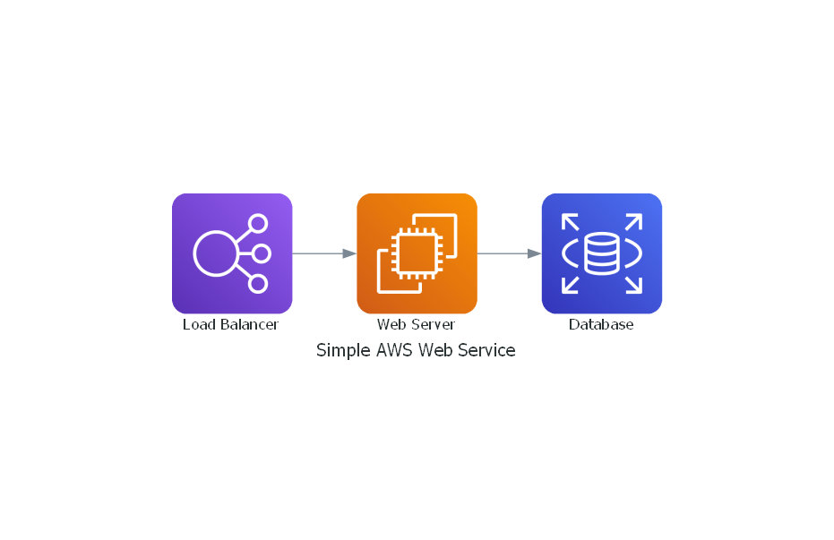

# Codify AWS Architecture Diagrams with Python: A Guide for DevOps Engineers

In the ever-evolving world of cloud infrastructure, visualization is key. As DevOps engineers, we often need to communicate complex architecture clearly and consistently across teams. That's where codifying your AWS architecture diagrams comes in. Instead of manually dragging and dropping icons in a GUI tool, you can now define your infrastructure diagrams as code using Python.

In this article, we'll explore how to use the Diagrams Python library to create AWS architecture diagrams that are version-controlled, repeatable, and scalable.

Diagrams lets you draw the cloud system architecture in Python code.

It was born for prototyping a new system architecture without any design tools. You can also describe or visualize the existing system architecture as well.

Diagram as Code allows you to track the architecture diagram changes in any version control system.

Diagrams currently supports main major providers including: AWS, Azure, GCP, Kubernetes, Alibaba Cloud, Oracle Cloud etc... It also supports On-Premises nodes, SaaS and major Programming frameworks and languages.

NOTE: It does not control any actual cloud resources nor does it generate cloud formation or terraform code. It is just for drawing the cloud system architecture diagrams.

## Why Use Diagrams-as-Code?

Version Control: Diagrams can be tracked, reviewed, and evolved over time in Git.

Automation: Generate diagrams programmatically as part of your CI/CD pipeline.

Consistency: Use reusable templates and modules for standardized architecture views.

Multi-Cloud: Support for AWS, Azure, GCP, Kubernetes, SaaS, and on-prem components.


### Step 1: Install Dependencies

First, ensure you have Python 3.6+ and Graphviz installed.

Install Diagrams Python library:

pip install diagrams

Now install Graphviz (the engine behind the visuals):

#### Install Graphviz (Windows):

Download from https://graphviz.org/download

Install and add C:\Program Files\Graphviz\bin to your system PATH

#### macOS:
```sh
brew install graphviz
```

#### Ubuntu/Debian:
```sh
sudo apt-get install graphviz
```

#### Amazon Linux:
```sh
yum install graphviz
```
### Step 2: Create Your First AWS Diagram

Here's a simple example showing an AWS load balancer connected to a web server and a database.

create a file named simple_aws_architecture.py

```python
from diagrams import Diagram
from diagrams.aws.compute import EC2
from diagrams.aws.database import RDS
from diagrams.aws.network import ELB

with Diagram("Simple AWS Web Service", show=True):
    lb = ELB("Load Balancer")
    web = EC2("Web Server")
    db = RDS("Database")

    lb >> web >> db
```
When you run this script, a PNG image (Simple AWS Web Service.png) will be generated.

Run it:
```sh
python simple_aws_architecture.py
```



Step 3: Model a Nested Clusters

Let's go a bit deeper and create a more Nested Clusters layout:

create a file named nested_cluster.py

```python
from diagrams import Cluster, Diagram
from diagrams.aws.compute import ECS, EKS, Lambda
from diagrams.aws.database import Redshift
from diagrams.aws.integration import SQS
from diagrams.aws.storage import S3

with Diagram("Event Processing", show=False):
    source = EKS("k8s source")

    with Cluster("Event Flows"):
        with Cluster("Event Workers"):
            workers = [ECS("worker1"),
                       ECS("worker2"),
                       ECS("worker3")]

        queue = SQS("event queue")

        with Cluster("Processing"):
            handlers = [Lambda("proc1"),
                        Lambda("proc2"),
                        Lambda("proc3")]

    store = S3("events store")
    dw = Redshift("analytics")

    source >> workers >> queue >> handlers
    handlers >> store
    handlers >> dw

```


### Step 4: Best Practices for Architecture as Code

Use Clusters: Group related resources like subnets, AZs, or environments.

Use Templates: Modularize frequently used patterns like 3-tier apps.

Add Labels: Use meaningful names for nodes and edges.

Automate: Include diagram generation in your CI pipeline.

### Final Thoughts

Diagrams-as-code brings the same benefits of infrastructure-as-code to your visual documentation. Whether you're designing, communicating, or auditing your AWS architecture, the Python Diagrams library is a lightweight and effective way to keep your diagrams aligned with your actual deployments.

References
https://diagrams.mingrammer.com/docs/getting-started/examples#clustered-web-services


